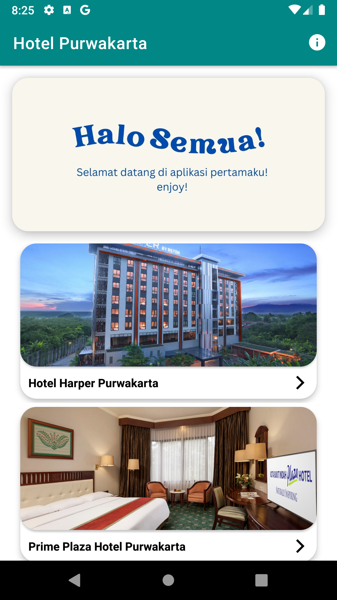
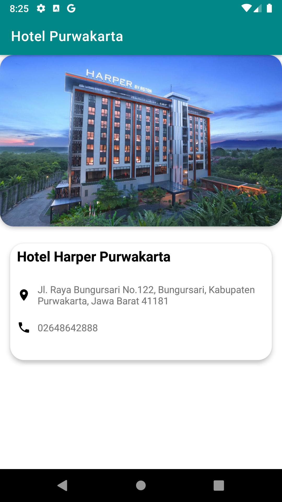
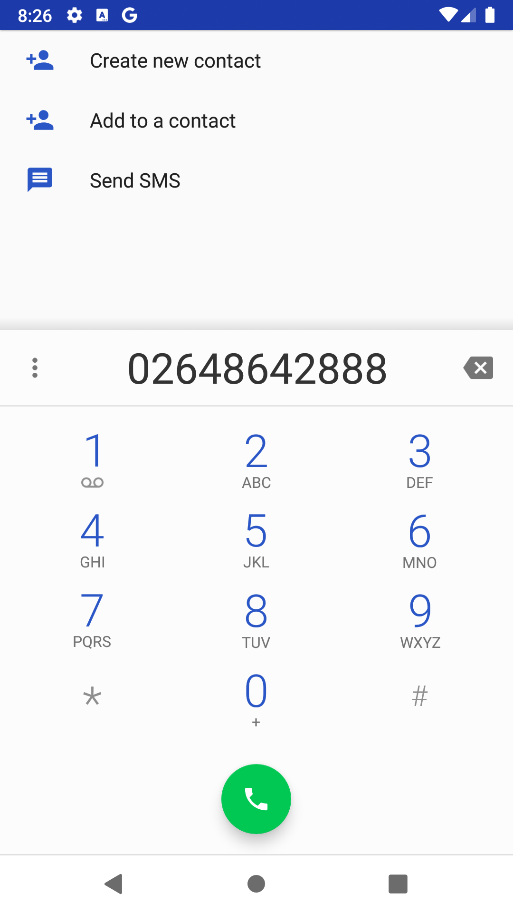
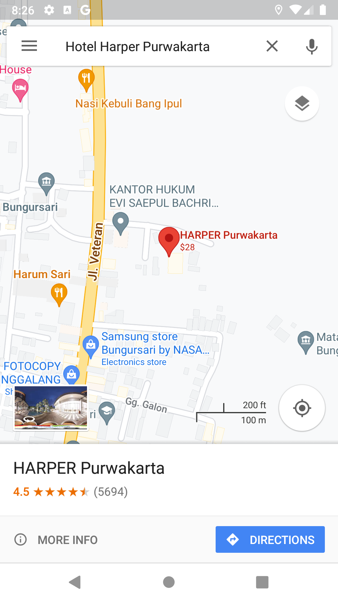
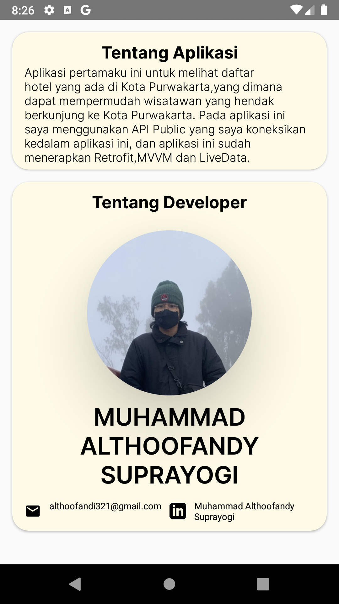

# Hotel Purwakarta
 This application functions to display several hotel options in the city of Purwakarta, in which there is information on the address and telephone number of the hotel which can be clicked directly from the application to the call page or Google Maps application by applying an implicit intent.
 
Showcase
--
https://user-images.githubusercontent.com/93589217/197785211-12ba892d-a6ef-4558-82e8-47db2dc21ee6.mp4

Screenshot
--

- Kotlin based.
- ViewModel - UI related data holder, lifecycle aware.
- Architecture
- MVVM Architecture (View - DataBinding - ViewBinding - ViewModel - Model)
- Retrofit2 & OkHttp3 - construct the APIs.
- Glide - loading images.
- Material-Components - Material design components for CardView.
 
 API
 --
 Saya menggunakan data yang ada di Aplikasi ini dari [Farizdotid](https://farizdotid.com/blog/dokumentasi-api-purwakarta/)
 
 Author
 --
 [Althoofandy](https://github.com/althoofandy) - althoofandi321@gmail.com\
 [Linkedin](https://www.linkedin.com/in/muhammad-althoofandy-suprayogi-32b016233/)
 

